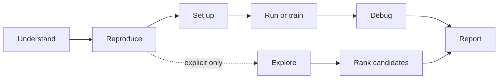
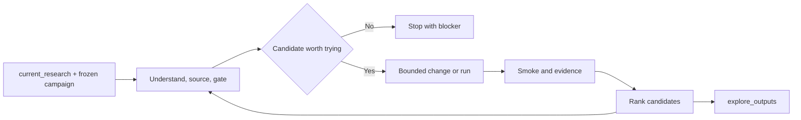

# RigorPilot Skills

Research-first Agent Skills for Deep Learning Experiments.

**Main idea:** RigorPilot keeps AI-assisted deep learning research grounded in
comparability, reproducible evidence, and auditable changes while an agent
reproduces, improves, or explores a research repository.

> Not just higher scores. Meaningful deep learning research progress.

<p>
  <a href="./README.md">English</a> |
  <a href="./README.zh-CN.md">简体中文</a>
</p>

<p>
  
  
  
  
  
  
  
  
  
</p>

## ⚡ At a Glance

| Focus | Summary |
|---|---|
| 🧭 Purpose | Research-first workflow skills for deep learning experiments, not a generic coding agent or score-chasing framework. |
| 🔒 Default rule | `trusted by default`: ambiguous requests route to reproduction, setup, run, train, analysis, or safe debugging. |
| 🧪 Exploration boundary | Explore work starts only when the researcher explicitly authorizes candidate-only exploration. |
| 📦 Evidence outputs | Artifacts are written to `repro_outputs/`, `analysis_outputs/`, `train_outputs/`, `debug_outputs/`, `explore_outputs/`, and related directories. |
| 🔗 Client contract | `SKILL.md` is the canonical contract; neutral Agent Skills, Codex, and Claude Code installs are supported. |

## 🚀 Start Fast

Most users only need one of these commands:

| Goal | Command |
|---|---|
| Install the full RigorPilot skill set | `npx skills add lllllllama/rigorpilot-skills --all` |
| Install the trusted reproduction entrypoint | `npx skills add lllllllama/rigorpilot-skills --skill ai-research-reproduction` |
| Install the explicit exploration entrypoint | `npx skills add lllllllama/rigorpilot-skills --skill ai-research-explore` |

Claude Code project commands:

- `/ai-research-reproduction`
- `/ai-research-explore`
- `/analyze-project`
- `/safe-debug`

<details>
<summary>Brand and migration compatibility</summary>

The project brand is `RigorPilot Skills`; the recommended GitHub repository
slug is `rigorpilot-skills`.

- Preferred install source: `lllllllama/rigorpilot-skills`
- Compatibility fallback: `lllllllama/ai-paper-reproduction-skills`
- `ai-paper-reproduction` migrated to `ai-research-reproduction`
- `research-explore` migrated to `ai-research-explore`
- Existing compatible skill slugs remain supported; `rigor-*` names are display modes today, not install aliases.

</details>

## 🎯 Choose an Entry Point

| What you want to do | RigorPilot display name | Current skill slug |
|---|---|---|
| Reproduce a deep learning repository from README commands | Rigor Reproduce | `ai-research-reproduction` |
| Analyze repository structure, entrypoints, and risks without editing | Rigor Analyze / Audit | `analyze-project` |
| Prepare environment, datasets, weights, and cache assumptions | Rigor Setup | `env-and-assets-bootstrap` |
| Run documented inference or evaluation conservatively | Rigor Run | `minimal-run-and-audit` |
| Start or verify training conservatively | Rigor Train | `run-train` |
| Debug a failure safely, diagnose before patching | Rigor Debug / Audit | `safe-debug` |
| Explore candidates on top of `current_research` | Rigor Explore | `ai-research-explore` |
| Implement candidate changes on an isolated branch | Rigor Improve | `explore-code` |
| Run small probes or short-cycle experiments | Rigor Explore / Improve | `explore-run` |

Bundled helper skills are usually called by orchestrators:

- `repo-intake-and-plan`
- `paper-context-resolver`

## 🛣️ Lane Model

### 🔒 Trusted Lane

Use this lane for reproduction, setup, read-only analysis, conservative
execution, training verification, and safe debugging.

- Primary entrypoint: `ai-research-reproduction`
- Output directories: `repro_outputs/`, `train_outputs/`, `analysis_outputs/`, `debug_outputs/`
- Core requirement: preserve scientific meaning, minimize semantic changes, and record assumptions, blockers, and evidence.

### 🧪 Explore Lane

Use this lane only when the researcher explicitly authorizes candidate-only
exploration.

- Primary entrypoint: `ai-research-explore`
- Leaf skills: `explore-code`, `explore-run`
- Output directory: `explore_outputs/`
- Key anchor: `current_research`

`current_research` should be a durable research state such as a branch, commit,
checkpoint, run record, or already-trained local model state. Explore outputs
are always candidate results. They must not claim trusted reproduction success,
complete benchmark results, or verified novelty.

## 🔬 Core Research Principles

1. Do not chase scores blindly: score gains must have explanatory value.
2. Do not claim novelty lightly: novelty needs literature, code, or experimental evidence.
3. Do not break comparability silently: if evaluation conditions change, say that results are not directly comparable.
4. Do not disguise engineering fixes as research contributions.
5. Do not leave collaborators out of control: important changes must be auditable, reversible, and explainable.

See [references/research-rigor-principles.md](references/research-rigor-principles.md)
and [references/agent-operating-principles.md](references/agent-operating-principles.md).

## 🔁 Lifecycle View

The repository follows a shallow lifecycle-oriented routing model:



The lifecycle helps the agent choose the right lane and evidence target. It
does not force every repository into a fixed implementation sequence.

## 🧠 Rigor Explore Flow

`ai-research-explore` fits cases where the researcher has already frozen the
task family, dataset, evaluation method, and SOTA references, then explicitly
authorizes bounded, auditable, candidate-only exploration on top of
`current_research`.



Current implementation highlights:

- Preserves researcher ideas and can add bounded synthesized or hybrid seed ideas.
- Ranks candidate ideas with hard gates and weighted breakdowns.
- Decomposes selected ideas into atomic academic concepts.
- Splits implementation fidelity into planned, heuristic, and observed evidence.
- Uses executor-emitted `changed_files`, `new_files`, `deleted_files`, and `touched_paths` as observed evidence.

## 🧾 Suggested Research Evidence

| Artifact | Purpose |
|---|---|
| `SCIENTIFIC_CHANGELOG.md` | Records what changed, why it changed, whether it affects scientific meaning, and whether it remains comparable. |
| `COMPARABILITY_REPORT.md` | Explains whether results can still be compared to the README, paper, baseline, or SOTA reference. |
| `REPRODUCIBILITY_NOTES.md` | Records commands, configs, seeds, checkpoints, datasets, environment assumptions, and known gaps. |
| `NOVELTY_CLAIM.md` | States possible novelty as a hypothesis, with supporting evidence, missing evidence, limitations, and required ablations. |
| `ABLATION_PLAN.md` | Describes which variables must be isolated to validate a candidate change. |
| `EXPERIMENT_LEDGER.md` | Records runs, metrics, commands, artifacts, changed files, and evidence status. |

`SCIENTIFIC_CHANGELOG.md` and `COMPARABILITY_REPORT.md` are already generated by
standard trusted / explore writers. The remaining names are future-compatible
evidence concepts.

## 📁 Output Directories

| Directory | Contents |
|---|---|
| `repro_outputs/` | Trusted reproduction bundle |
| `train_outputs/` | Trusted training bundle |
| `analysis_outputs/` | Read-only analysis, research map, change map, eval contract, idea seeds, atomic idea map, implementation fidelity, and related outputs |
| `debug_outputs/` | Safe debug diagnosis and patch plan |
| `sources/` | Free-first research lookup records, repo-local extraction, and auditable index |
| `explore_outputs/` | Changeset, idea gate, experiment plan, manifest, ledger, candidate ranking, and related outputs |

## 🧩 Campaign Inputs

`ai-research-explore` still accepts `variant_spec.json`, but
`research_campaign.json` or `research_campaign.yaml` is preferred for Rigor
Explore campaigns.

Durable core fields:

- `current_research`
- `task_family`
- `dataset`
- `benchmark`
- `evaluation_source`
- `sota_reference`
- `compute_budget`

Optional fields:

- `candidate_ideas`
- `variant_spec`
- `research_lookup`
- `idea_policy`
- `idea_generation`
- `source_constraints`
- `feasibility_policy`

See [skills/ai-research-explore/references/research-campaign-spec.md](skills/ai-research-explore/references/research-campaign-spec.md).

## 🛠️ Local Install

Use the Python installer only when developing locally, needing a project-scoped
install, or manually targeting client directories.

```bash
python scripts/install_skills.py --client agents --target "$HOME/.agents/skills" --force
python scripts/install_skills.py --client codex --target "$HOME/.codex/skills" --force
python scripts/install_skills.py --client claude --target "$HOME/.claude/skills" --force
```

Project-scoped examples:

```bash
python scripts/install_skills.py --client agents --target ./.agents/skills --force
python scripts/install_skills.py --client claude --target ./.claude/skills --force
```

These commands are written to work in both Windows PowerShell and Linux shells.

## 💬 Example Prompts

**Trusted reproduction**

```text
Use ai-research-reproduction on this deep learning research repo. Stay README-first, prefer documented inference or evaluation, avoid unnecessary repo changes, and write outputs to repro_outputs/.
```

**Read-only analysis**

```text
Use analyze-project on this repo. Read the code, map the model and training entrypoints, and flag suspicious patterns without editing files.
```

**Safe debug**

```text
Use safe-debug on this traceback. Diagnose the failure first, propose the smallest safe fix, and do not patch until I approve.
```

**Candidate exploration**

```text
Use ai-research-explore with research_campaign.json. Treat the task family, dataset, evaluation source, and SOTA table as frozen inputs. Rank candidate ideas and write evidence outputs to analysis_outputs/ and explore_outputs/.
```

## ✅ Local Validation

Basic checks:

```bash
python scripts/validate_repo.py
python scripts/test_skill_registry.py
python scripts/test_trigger_boundaries.py
python scripts/test_operating_principles_structure.py
python scripts/test_claude_command_wrappers.py
python scripts/test_readme_selection.py
```

Core output and explore regressions:

```bash
python scripts/test_output_rendering.py
python scripts/test_train_output_rendering.py
python scripts/test_analysis_output_rendering.py
python scripts/test_safe_debug_output_rendering.py
python scripts/test_research_explore_dry_run.py
python scripts/test_research_explore_campaign_flow.py
python scripts/test_research_explore_artifact_consistency.py
python scripts/test_research_explore_variant_execution.py
python scripts/test_research_explore_nontraining_execution.py
python scripts/test_atomic_idea_decomposition.py
python scripts/test_idea_seed_generation.py
python scripts/test_implementation_fidelity.py
```

Install-related regressions:

```bash
python scripts/test_bootstrap_env.py
python scripts/test_install_targets.py
python scripts/test_setup_planning.py
```

## 🧭 Current Repo Snapshot

- `11` skills total: `9` public skills and `2` helper skills.
- `6` trusted-lane public skills and `3` explore-lane public skills.
- `4` project-scoped Claude Code wrappers under `.claude/commands/`.
- `45` Python scripts, including `43` test scripts.
- Documentation and command examples are kept usable from both Windows PowerShell and Linux shells.

## ⚠️ Current Limits

- `run-train` is a bounded training monitor, not a long-running training scheduler.
- Trusted reproduction avoids silent semantic changes.
- Helper skills stay narrow and are not public catch-all entrypoints.
- Exploratory work must stay isolated from trusted baselines.
- `ai-research-explore` is the governed Rigor Explore compatible slug, not an open-ended autonomous research agent.

## 📚 References

- [Research rigor principles](references/research-rigor-principles.md)
- [Deep learning experiment principles](references/deep-learning-experiment-principles.md)
- [Shared operating principles](references/agent-operating-principles.md)
- [Skill registry](references/skill-registry.json)
- [Routing policy](references/routing-policy.md)
- [Trigger boundary policy](references/trigger-boundary-policy.md)
- [Client compatibility policy](references/client-compatibility-policy.md)
- [Output contract](references/output-contract.md)
- [Research pitfall checklist](references/research-pitfall-checklist.md)

## 🧱 Scope

RigorPilot Skills is a research-first skill repository for deep learning
experiments. It focuses on scientific meaning, comparability, reproducibility,
collaborator control, and auditable workflow boundaries. It helps agents move
research forward more reliably, but it does not replace researcher judgment.
