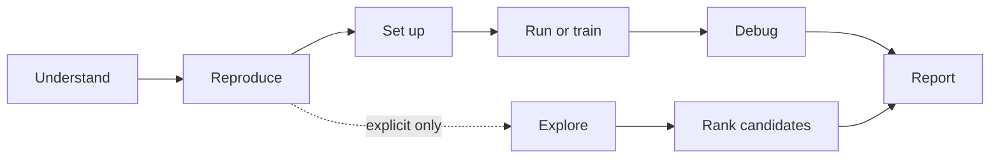
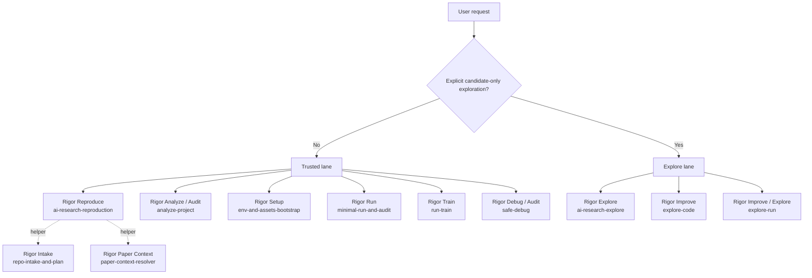
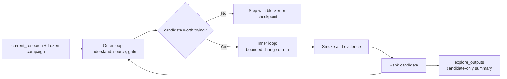

# RigorPilot Skills

Research-first Agent Skills for Deep Learning Experiments.

RigorPilot helps AI agents reproduce, improve, and explore deep learning
research projects with scientific rigor: meaningful changes, fair comparison,
reproducible evidence, and auditable modifications.

> Not just higher scores. Meaningful deep learning research progress.

<p>
  <a href="./README.md">English</a> |
  <a href="./README.zh-CN.md">简体中文</a>
</p>

<p>
  
  
  
  
  
  
  
  
  
</p>

Brand note: the project brand is `RigorPilot Skills`; the recommended GitHub
repository slug is `rigorpilot-skills`. Legacy install paths remain documented
only as compatibility fallbacks while older clients and bookmarks migrate.

Migration note:
- Project brand: `ai-research-workflow-skills` -> `RigorPilot Skills`
- Existing compatible skill slugs remain available.
- Preferred install source: `lllllllama/rigorpilot-skills`
- Legacy fallback source: `lllllllama/ai-paper-reproduction-skills`
- `ai-paper-reproduction` -> `ai-research-reproduction`
- `research-explore` -> `ai-research-explore`

## What RigorPilot Is

- Research-first Agent Skills for deep learning experiments.
- It helps AI agents reproduce, improve, explore, and audit deep learning research work.
- It is designed for personal research use first.
- It values scientific meaning, fair comparison, reproducibility, explainability, and collaborator control.
- It encourages meaningful novelty during exploration, but does not overclaim novelty.

## What RigorPilot Is Not

- Not a generic coding agent.
- Not a score-chasing automation framework.
- Not a guarantee of novel discoveries.
- Not a replacement for researcher judgment.
- Not a rigid workflow that should weaken strong models.

## Core Principles

1. Do not chase scores blindly.
2. Do not claim novelty lightly.
3. Do not break comparability silently.
4. Do not disguise engineering fixes as research contributions.
5. Do not leave collaborators out of control.

See [references/research-rigor-principles.md](references/research-rigor-principles.md).

## Rigor and Novelty

Rigor is the baseline. Novel is the aspiration.

Novelty and significance remain hypotheses until supported by literature
contrast, ablation evidence, and fair comparison.

RigorPilot should add research judgment and audit awareness without making
strong models slower, more mechanical, or less capable.

## Deep Learning Focus

RigorPilot is built for deep learning research repositories where README
commands, environment setup, data, weights, checkpoints, training, evaluation,
metrics, logs, baselines, SOTA tables, and ablations all matter.

This repository is still built around one compatibility rule: `trusted by default`.

- Ambiguous requests route to the trusted lane.
- Exploration requires explicit authorization.
- Trusted outputs are auditable and durable.
- Explore outputs are candidate-only and disposable.

Shared operating principles live in
[references/agent-operating-principles.md](references/agent-operating-principles.md).
They keep the skills focused on high-level guidance: think before acting, keep
the solution small, change only what is necessary, and work toward verifiable
goals. They are guardrails, not a detailed script for every implementation
choice.

## 🧭 Current Repo Snapshot

This repository currently ships:

- `11` skills total: `9` public skills and `2` helper skills.
- `6` trusted-lane public skills and `3` explore-lane public skills.
- `4` project-scoped Claude Code command wrappers under `.claude/commands/`.
- `45` Python scripts, including `43` test scripts with focused `research-explore` regressions and document-structure checks.
- A Rigor Explore chain that now includes bounded idea-seed generation, explicit idea score breakdowns, atomic idea decomposition, and implementation-fidelity evidence split into planned, heuristic, and observed layers.
- A documented and tested workflow intended to be usable from both Windows PowerShell and Linux shells.

The skills use the open `SKILL.md` layout, so the same repository can be installed into neutral Agent Skills directories as well as Codex and Claude Code. For shared local installs, prefer `~/.agents/skills/` or `./.agents/skills/`. Client-specific installs under `~/.codex/skills/` and `~/.claude/skills/` remain supported.

## 💻 Windows and Linux Notes

This repository is intended to be usable on both Windows and Linux.

- The command examples below are written in a shell-neutral style around `python ...`, `npx ...`, and relative paths.
- For user-scoped install targets, prefer `$HOME/.agents/skills`, `$HOME/.codex/skills`, and `$HOME/.claude/skills`. These work well in Linux shells and in PowerShell, and Python accepts forward slashes on Windows paths.
- Project-scoped paths such as `./.agents/skills` and `./tmp/codex-skills` are also valid on both platforms.
- The repository validation and routing checks are already exercised on Windows and Linux-oriented environments through local tests and CI.

## 🛠️ Install

For most users, start with `npx`. It is the shortest path and should be enough for normal use.

### Recommended: `npx`

Install the full repository skill set:

```bash
npx skills add lllllllama/rigorpilot-skills --all
```

Install only the trusted main entrypoint:

```bash
npx skills add lllllllama/rigorpilot-skills --skill ai-research-reproduction
```

Install only the exploratory main entrypoint:

```bash
npx skills add lllllllama/rigorpilot-skills --skill ai-research-explore
```

If you only want to get started quickly, stop here.

Claude Code can auto-invoke these skills when the descriptions match, or you can call them directly with commands such as `/ai-research-reproduction`, `/ai-research-explore`, and `/safe-debug`.

Project-scoped Claude Code slash commands currently ship for:

- `/ai-research-reproduction`
- `/ai-research-explore`
- `/analyze-project`
- `/safe-debug`

### Advanced: local clone installs

Use the Python installer only if you are developing locally, need a project-scoped install, or want to target neutral Agent Skills, Codex, or Claude Code directories manually.

<details>
<summary>Show local install commands</summary>

Install from a local clone into a neutral Agent Skills directory:

```bash
python scripts/install_skills.py --client agents --target "$HOME/.agents/skills" --force
```

Install into a project-scoped neutral Agent Skills directory:

```bash
python scripts/install_skills.py --client agents --target ./.agents/skills --force
```

Install with the default neutral target:

```bash
python scripts/install_skills.py --force
```

Install the full repository skill set in Codex:

```bash
npx skills add lllllllama/rigorpilot-skills --all
```

Install only the trusted reproduction orchestrator in Codex:

```bash
npx skills add lllllllama/rigorpilot-skills --skill ai-research-reproduction
```

Legacy GitHub source fallback, if the new slug is not yet available in your
environment:

```bash
npx skills add lllllllama/ai-paper-reproduction-skills --all
```

Install from a local clone into Codex:

```bash
python scripts/install_skills.py --client codex --target "$HOME/.codex/skills" --force
```

Install from a local clone into Claude Code:

```bash
python scripts/install_skills.py --client claude --target "$HOME/.claude/skills" --force
```

Install into a project-scoped Claude Code skills directory:

```bash
python scripts/install_skills.py --client claude --target ./.claude/skills --force
```

PowerShell note:

- In Windows PowerShell, the same commands work as written above.
- If you prefer explicit Windows-style paths, replace `$HOME/.codex/skills` with something like `$env:USERPROFILE\\.codex\\skills`.

</details>

## 🎯 Choose an Entry Point

RigorPilot display names map to the current compatible skill slugs. The short
mode is a RigorPilot display/documentation name and possible future alias; use
the current compatible skill slug for today's `npx skills add --skill ...` and
direct skill calls.

| If you want to... | RigorPilot display name | Short mode | Current compatible skill slug |
|---|---|---|---|
| Reproduce a deep learning repository from README commands | Rigor Reproduce | `rigor-reproduce` | `ai-research-reproduction` |
| Explore meaningful and potentially novel ideas on top of current research | Rigor Explore | `rigor-explore` | `ai-research-explore` |
| Improve a baseline while preserving comparability | Rigor Improve | `rigor-improve` | `ai-research-explore`, `explore-code`, `explore-run` |
| Audit changes, scientific meaning, and comparability | Rigor Audit | `rigor-audit` | `analyze-project`, `safe-debug`, generated reports |
| Analyze repository structure without editing | Rigor Analyze | `rigor-analyze` | `analyze-project` |
| Prepare environment, datasets, weights, and cache assumptions | Rigor Setup | `rigor-setup` | `env-and-assets-bootstrap` |
| Run documented evaluation or inference conservatively | Rigor Run | `rigor-run` | `minimal-run-and-audit` |
| Start or verify training conservatively | Rigor Train | `rigor-train` | `run-train` |
| Debug a failure safely | Rigor Debug | `rigor-debug` | `safe-debug` |

Bundled helper skills:

- Rigor Intake / `rigor-intake` -> `repo-intake-and-plan`
- Rigor Paper Context / `rigor-paper-context` -> `paper-context-resolver`

## 🛣️ Lane Model

### 🔒 Trusted Lane

Use the trusted lane for reproduction, setup, analysis, bounded execution, training verification, and debugging.

- Primary end-to-end orchestrator: `ai-research-reproduction`
- Output directories: `repro_outputs/`, `train_outputs/`, `analysis_outputs/`, `debug_outputs/`
- Default stance: preserve scientific meaning, minimize semantic changes, surface assumptions and blockers

### 🧪 Explore Lane

Use the explore lane only when the researcher explicitly authorizes candidate-only exploratory work.

- Primary end-to-end orchestrator: `ai-research-explore`
- Narrow leaf skills: `explore-code`, `explore-run`
- Output directory: `explore_outputs/`
- Key anchor: `current_research`

`current_research` should be a durable reference such as a branch, commit, checkpoint, run record, or already-trained local model state. It does not imply a trusted baseline; it is the context the exploration branches from.

### 🧰 Helper Lane

Helpers are intentionally narrow and should usually be orchestrator-invoked rather than used as the first entry point.

## 🔗 Client Compatibility

`SKILL.md` is the canonical cross-client contract in this repository.

- Required for portability: `SKILL.md`, repository-local `scripts/`, and `references/`
- Optional Codex UI metadata: `agents/openai.yaml`
- Optional Claude Code project entrypoints: `.claude/commands/*.md`
- Not allowed: making skill behavior depend on a client-specific metadata file

See [references/client-compatibility-policy.md](references/client-compatibility-policy.md).

## 🔁 Lifecycle View

The repository follows a lifecycle-oriented routing model:



This lifecycle is intentionally shallow. It helps the agent choose the right
lane and evidence target without forcing a fixed implementation sequence inside
each repository.

## 🗺️ Routing Overview



## 🧠 Rigor Explore Flow

`ai-research-explore` is the Rigor Explore compatible slug when the researcher
has already frozen the task family, dataset, evaluation method, and provided
SOTA references, then explicitly authorizes candidate-only exploration on top
of `current_research`. This was previously documented as the third-scenario
campaign flow. In RigorPilot terms, this is meaningful and potentially novel
candidate work, not verified novelty.



Current RigorPilot implementation highlights:

- Researcher ideas are preserved, then optionally expanded with bounded synthesized or hybrid seed ideas in `analysis_outputs/IDEA_SEEDS.json`.
- Idea ranking uses hard gates plus explicit weighted breakdowns in `analysis_outputs/IDEA_SCORES.json`.
- Selected ideas are decomposed into atomic academic concepts in `analysis_outputs/ATOMIC_IDEA_MAP.md` and `analysis_outputs/ATOMIC_IDEA_MAP.json`.
- Implementation fidelity distinguishes planned, heuristic, and observed implementation evidence in `analysis_outputs/IMPLEMENTATION_FIDELITY.md` and `analysis_outputs/IMPLEMENTATION_FIDELITY.json`.
- Executor-observed evidence now comes from emitted `changed_files`, `new_files`, `deleted_files`, and `touched_paths` rather than planned target placeholders.

The two-loop rhythm is a guide, not a never-stop autonomous agent. Rigor Explore
stops at explicit blockers, unclear scientific meaning, exhausted budget,
missing anchors, or human checkpoints. The explore lane must not claim trusted
reproduction success, global benchmark completeness, or verified novelty.

## 📦 Public Skill Matrix

| Lane | RigorPilot display name | Short mode | Compatible skill slug | Purpose |
|---|---|---|---|---|
| Trusted | Rigor Reproduce | `rigor-reproduce` | `ai-research-reproduction` | End-to-end README-first reproduction orchestrator |
| Trusted | Rigor Setup | `rigor-setup` | `env-and-assets-bootstrap` | Conservative environment, dataset, checkpoint, and cache planning |
| Trusted | Rigor Run | `rigor-run` | `minimal-run-and-audit` | Trusted inference, evaluation, smoke, and sanity execution |
| Trusted | Rigor Analyze / Rigor Audit | `rigor-analyze`, `rigor-audit` | `analyze-project` | Read-only project analysis, model mapping, and risk surfacing |
| Trusted | Rigor Train | `rigor-train` | `run-train` | Training startup verification, resume handling, bounded monitoring, and training records |
| Trusted | Rigor Debug / Rigor Audit | `rigor-debug`, `rigor-audit` | `safe-debug` | Research-safe debugging: analyze first, patch only after approval |
| Explore | Rigor Explore | `rigor-explore` | `ai-research-explore` | Current-research exploration with repo understanding, idea gating, and governed experiments |
| Explore | Rigor Improve | `rigor-improve` | `explore-code` | Candidate implementation, transplant, and stitching on isolated branches |
| Explore | Rigor Improve / Rigor Explore | `rigor-improve`, `rigor-explore` | `explore-run` | Small-subset probes, short-cycle trials, and ranked exploratory runs |
| Helper | Rigor Intake | `rigor-intake` | `repo-intake-and-plan` | Narrow helper for repo scanning and README command extraction |
| Helper | Rigor Paper Context | `rigor-paper-context` | `paper-context-resolver` | Narrow helper for README-paper gap resolution |

## 🧪 Testing Coverage Map

This repository does not publish a single line-coverage percentage in the README. Instead, it documents the regression surface that is currently covered by repository tests.

| Coverage area | Current scope | Representative checks |
|---|---|---|
| Registry, installation, and wrappers | File-level integrity, install targets, Claude wrappers, README routing | `test_skill_registry.py`, `test_install_targets.py`, `test_claude_command_wrappers.py`, `test_readme_selection.py` |
| Skill principles and concision | Shared operating principles, lifecycle docs, and compact main entrypoints | `test_operating_principles_structure.py` |
| Trusted lane rendering and routing | Reproduction, training, analysis, debug, lane routing | `test_output_rendering.py`, `test_train_output_rendering.py`, `test_analysis_output_rendering.py`, `test_safe_debug_output_rendering.py`, `test_training_lane_routing.py` |
| Explore lane orchestration | Dry run, campaign flow, checkpoint, abandon path, artifact consistency, execution feasibility | `test_research_explore_dry_run.py`, `test_research_explore_campaign_flow.py`, `test_research_explore_campaign_checkpoint.py`, `test_research_explore_campaign_abandon.py`, `test_research_explore_artifact_consistency.py` |
| Explore idea and implementation contracts | Idea seeds, atomic decomposition, implementation fidelity, contract shape | `test_idea_seed_generation.py`, `test_atomic_idea_decomposition.py`, `test_implementation_fidelity.py`, `test_research_explore_contracts.py` |
| Explore execution evidence | Training and non-training executor evidence propagation | `test_research_explore_variant_execution.py`, `test_research_explore_nontraining_execution.py` |
| Research lookup | Provider resolution, cache, inventory rendering, repo extractors, evidence layering | `test_research_lookup_arxiv_provider.py`, `test_research_lookup_repo_extractor.py`, `test_research_lookup_inventory_rendering.py`, `test_research_lookup_evidence_layers.py` |

Coverage notes:

- `scripts/validate_repo.py` is still the fast file-level validator.
- Deeper behavior contracts are primarily guarded by the explore and rendering regression tests above.
- GitHub Actions validates the repository on `ubuntu-latest`, `macos-latest`, and `windows-latest`.

## 📁 Output Directories

| Directory | Purpose |
|---|---|
| `repro_outputs/` | Trusted reproduction bundle |
| `train_outputs/` | Trusted training execution bundle |
| `analysis_outputs/` | Read-only project analysis plus research map, change map, eval contract, source inventory/support, improvement bank, idea cards, idea seeds, atomic idea map, implementation fidelity, mapping, and resource plan |
| `debug_outputs/` | Safe debug diagnosis and patch plan |
| `sources/` | Free-first research lookup records with `sources/records/`, stable names, bounded provider resolution, repo-local extraction, and an auditable index |
| `explore_outputs/` | Rigor Explore changeset, idea gate, experiment plan, experiment manifest, scientific changelog, comparability report, split static/runtime smoke reporting, ledger, and ranked run summary |

## Suggested Research Evidence

Two evidence artifacts are now generated by the standardized trusted and
explore writers; the remaining names are future-compatible evidence concepts:

| Artifact | Meaning |
|---|---|
| `SCIENTIFIC_CHANGELOG.md` | Generated now. Records what changed, why it changed, whether it affects scientific meaning, and whether it remains comparable. |
| `COMPARABILITY_REPORT.md` | Generated now. Explains whether results can still be compared to README, paper, baseline, or SOTA references. |
| `REPRODUCIBILITY_NOTES.md` | Records commands, configs, seeds, checkpoints, datasets, environment assumptions, and known gaps. |
| `NOVELTY_CLAIM.md` | States possible novelty as a hypothesis, supporting evidence, missing evidence, limitations, and required ablations. |
| `ABLATION_PLAN.md` | Describes what needs to be isolated to validate the candidate change. |
| `EXPERIMENT_LEDGER.md` | Records runs, metrics, commands, artifacts, changed files, and evidence status. |

Existing outputs such as `analysis_outputs/`, `sources/`, `explore_outputs/`,
`repro_outputs/`, `train_outputs/`, and `debug_outputs/` remain compatible.
RigorPilot may gradually map more existing artifacts to these research evidence
concepts.

## 🧩 Campaign Inputs

`ai-research-explore` still accepts a plain `variant_spec.json`, but the preferred input for Rigor Explore campaigns is `research_campaign.json` or `research_campaign.yaml`.

The durable campaign core is:

- `current_research`
- `task_family`
- `dataset`
- `benchmark`
- `evaluation_source`
- `sota_reference`
- `compute_budget`

`candidate_ideas` and `variant_spec` are useful, but they are not required in
every campaign. `ai-research-explore` preserves researcher ideas and may add a
small number of bounded synthesized or hybrid seed ideas for search-space
expansion. Generated seeds stay bound to `current_research`, `task_family`,
`dataset`, and the frozen `evaluation_source`.

Optional campaign blocks:

- `research_lookup`
- `idea_policy`
- `idea_generation`
- `source_constraints`
- `feasibility_policy`

See [skills/ai-research-explore/references/research-campaign-spec.md](skills/ai-research-explore/references/research-campaign-spec.md).

## 💬 Example Prompts

**Trusted reproduction**

```text
Use ai-research-reproduction on this deep learning research repo. Stay README-first, prefer documented inference or evaluation, avoid unnecessary repo changes, and write outputs to repro_outputs/.
```

**Current-research exploration**

```text
Use ai-research-explore on top of current_research improved-model@branch. Work on an isolated branch, coordinate code and run exploration together, try several variants, and rank candidates in explore_outputs/.
```

**Third-scenario campaign exploration**

```text
Use ai-research-explore with research_campaign.json. Treat the provided task family, dataset, evaluation source, and SOTA table as frozen inputs, rank the candidate ideas, keep each candidate single-variable, and write RigorPilot evidence outputs to analysis_outputs/ and explore_outputs/.
```

**Read-only analysis**

```text
Use analyze-project on this repo. Read the code, map the model and training entrypoints, and flag suspicious patterns without editing files.
```

**Trusted training**

```text
Use run-train on this repo. Run the selected documented training command conservatively for startup verification and write train_outputs/.
```

**Safe debug**

```text
Use safe-debug on this traceback. Diagnose the failure first, propose the smallest safe fix, and do not patch until I approve.
```

**Exploratory code only**

```text
Use explore-code on an isolated branch. Try a LoRA adaptation for this backbone, keep it exploratory only, and summarize the changes in explore_outputs/.
```

**Exploratory runs only**

```text
Use explore-run on an experiment branch. Do a small-subset short-cycle sweep, rank the top runs, and treat the results as candidates only.
```

## ✅ Local Validation

Run the repository checks:

```bash
python scripts/validate_repo.py
python scripts/test_skill_registry.py
python scripts/test_trigger_boundaries.py
python scripts/test_operating_principles_structure.py
python scripts/test_claude_command_wrappers.py
python scripts/test_readme_selection.py
```

Run output and orchestration regressions:

```bash
python scripts/test_output_rendering.py
python scripts/test_train_output_rendering.py
python scripts/test_analysis_output_rendering.py
python scripts/test_safe_debug_output_rendering.py
python scripts/test_explore_output_rendering.py
python scripts/test_explore_variant_matrix.py
python scripts/test_atomic_idea_decomposition.py
python scripts/test_idea_seed_generation.py
python scripts/test_implementation_fidelity.py
python scripts/test_research_explore_contracts.py
python scripts/test_research_explore_dry_run.py
python scripts/test_research_explore_campaign_flow.py
python scripts/test_research_explore_campaign_abandon.py
python scripts/test_research_explore_campaign_checkpoint.py
python scripts/test_research_explore_artifact_consistency.py
python scripts/test_research_explore_variant_execution.py
python scripts/test_research_explore_nontraining_execution.py
python scripts/test_orchestrator_dry_run.py
python scripts/test_training_lane_routing.py
```

Run research-lookup regressions:

```bash
python scripts/test_research_lookup_arxiv_provider.py
python scripts/test_research_lookup_doi_provider.py
python scripts/test_research_lookup_github_provider.py
python scripts/test_research_lookup_url_provider.py
python scripts/test_research_lookup_repo_extractor.py
python scripts/test_research_lookup_cache.py
python scripts/test_research_lookup_inventory_rendering.py
python scripts/test_research_lookup_evidence_layers.py
```

Run setup and installer regressions:

```bash
python scripts/test_bootstrap_env.py
python scripts/test_install_targets.py
python scripts/test_setup_planning.py
python scripts/install_skills.py --client agents --target ./tmp/agents-skills --force
python scripts/install_skills.py --client codex --target ./tmp/codex-skills --force
python scripts/install_skills.py --client claude --target ./tmp/claude-skills --force
```

## 📚 References

- Research rigor principles: [references/research-rigor-principles.md](references/research-rigor-principles.md)
- Deep learning experiment principles: [references/deep-learning-experiment-principles.md](references/deep-learning-experiment-principles.md)
- Shared operating principles: [references/agent-operating-principles.md](references/agent-operating-principles.md)
- Skill registry: [references/skill-registry.json](references/skill-registry.json)
- Explore variant spec: [references/explore-variant-spec.md](references/explore-variant-spec.md)
- Explore module roadmap: [references/explore-module-roadmap.md](references/explore-module-roadmap.md)
- Client compatibility policy: [references/client-compatibility-policy.md](references/client-compatibility-policy.md)
- Routing policy: [references/routing-policy.md](references/routing-policy.md)
- Trigger boundary policy: [references/trigger-boundary-policy.md](references/trigger-boundary-policy.md)
- Branch and commit policy: [references/branch-and-commit-policy.md](references/branch-and-commit-policy.md)
- Output contract: [references/output-contract.md](references/output-contract.md)
- Research pitfall checklist: [references/research-pitfall-checklist.md](references/research-pitfall-checklist.md)

## ⚠️ Current Limits

- `run-train` is a bounded training monitor, not a full long-running scheduler.
- Trusted reproduction still avoids silent semantic changes.
- Helper skills remain narrow and are not intended to become public catch-all entry points.
- Exploratory work must stay isolated from trusted baselines.
- `ai-research-explore` is the governed Rigor Explore compatible slug, not an open-ended autonomous research agent.

## 🧱 Scope

RigorPilot Skills is a research-first skill repository for deep learning
experiments, optimized for scientific meaning, comparability, reproducibility,
collaborator control, and auditable workflow boundaries.
