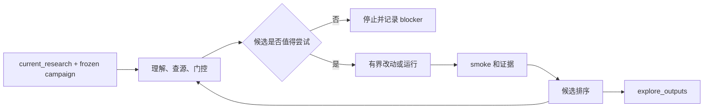

# RigorPilot Skills

面向深度学习实验的科研优先 Agent Skills。

**一句话主旨：** RigorPilot 让 AI agent 在复现、改进、探索深度学习研究仓库时，始终保留可比性、可复现实验证据和可审计的改动边界。

> 不只是更高分数，而是有意义的深度学习科研推进。

<p>
  <a href="./README.md">English</a> |
  <a href="./README.zh-CN.md">简体中文</a>
</p>

<p>
  
  
  
  
  
  
  
  
  
</p>

## ⚡ 一眼看懂

| 重点 | 说明 |
|---|---|
| 🧭 项目定位 | 面向深度学习实验的科研 workflow skills，不是普通 coding agent，也不是刷分自动化框架。 |
| 🔒 默认原则 | `trusted by default`：模糊请求默认走可信复现、环境准备、运行、训练、分析或安全调试。 |
| 🧪 探索边界 | 只有研究者明确授权 candidate-only 探索时，才进入 explore lane。 |
| 📦 证据产物 | 输出写入 `repro_outputs/`、`analysis_outputs/`、`train_outputs/`、`debug_outputs/`、`explore_outputs/` 等目录。 |
| 🔗 跨客户端合同 | `SKILL.md` 是 canonical contract；支持中立 Agent Skills、Codex 和 Claude Code。 |

## 🚀 快速开始

大多数用户只需要下面三条之一：

| 目标 | 命令 |
|---|---|
| 安装整套 RigorPilot skills | `npx skills add lllllllama/rigorpilot-skills --all` |
| 安装可信复现主入口 | `npx skills add lllllllama/rigorpilot-skills --skill ai-research-reproduction` |
| 安装显式探索主入口 | `npx skills add lllllllama/rigorpilot-skills --skill ai-research-explore` |

Claude Code 可直接使用项目级命令：

- `/ai-research-reproduction`
- `/ai-research-explore`
- `/analyze-project`
- `/safe-debug`

<details>
<summary>品牌与迁移兼容</summary>

项目品牌已经收敛为 `RigorPilot Skills`，推荐 GitHub 仓库 slug 为 `rigorpilot-skills`。

- 推荐安装源：`lllllllama/rigorpilot-skills`
- 兼容 fallback：`lllllllama/ai-paper-reproduction-skills`
- `ai-paper-reproduction` 已迁移为 `ai-research-reproduction`
- `research-explore` 已迁移为 `ai-research-explore`
- 现有兼容 skill slug 会继续保留；`rigor-*` 当前主要是 display mode，不是安装 alias。

</details>

## 🎯 该用哪个入口

| 你想做什么 | RigorPilot display name | 当前 skill slug |
|---|---|---|
| 从 README 命令出发复现深度学习仓库 | Rigor Reproduce | `ai-research-reproduction` |
| 只读分析仓库结构、入口、风险 | Rigor Analyze / Audit | `analyze-project` |
| 准备环境、数据、权重、缓存假设 | Rigor Setup | `env-and-assets-bootstrap` |
| 保守执行已记录的 inference / evaluation | Rigor Run | `minimal-run-and-audit` |
| 保守启动或验证训练 | Rigor Train | `run-train` |
| 安全调试失败，先诊断后 patch | Rigor Debug / Audit | `safe-debug` |
| 在 `current_research` 上做候选探索 | Rigor Explore | `ai-research-explore` |
| 在隔离分支实现候选改动 | Rigor Improve | `explore-code` |
| 做小样本 probe 或短周期试验 | Rigor Explore / Improve | `explore-run` |

内置 helper skills 通常由 orchestrator 调用：

- `repo-intake-and-plan`
- `paper-context-resolver`

## 🛣️ 两条主线

### 🔒 Trusted Lane

用于复现、环境准备、只读分析、保守执行、训练验证和安全调试。

- 主入口：`ai-research-reproduction`
- 输出目录：`repro_outputs/`、`train_outputs/`、`analysis_outputs/`、`debug_outputs/`
- 核心要求：保持科学含义不变，减少语义性改动，显式记录假设、blocker 和证据。

### 🧪 Explore Lane

只在研究者明确授权 candidate-only 探索时启用。

- 主入口：`ai-research-explore`
- 叶子技能：`explore-code`、`explore-run`
- 输出目录：`explore_outputs/`
- 核心锚点：`current_research`

`current_research` 应该是可追踪的研究状态，例如 branch、commit、checkpoint、run record 或已训练模型状态。Explore 结果始终是候选结果，不能声称已经完成可信复现、完整 benchmark 或已验证 novelty。

## 🔬 科研严谨性原则

1. 不盲目追分：分数提升必须有解释价值。
2. 不轻易声称创新：novelty 必须有文献、代码或实验依据。
3. 不破坏可比性：如果改变评估条件，必须说明结果不可直接比较。
4. 不隐藏工程修补：工程修补不能包装成方法贡献。
5. 不让合作者失控：重要修改必须可审计、可回滚、可解释。

详见 [references/research-rigor-principles.md](references/research-rigor-principles.md) 和 [references/agent-operating-principles.md](references/agent-operating-principles.md)。

## 🧠 Rigor Explore 流程

`ai-research-explore` 适合这样的场景：研究者已经冻结 task family、dataset、evaluation method 和 SOTA 参考，并明确授权 AI 在 `current_research` 上做受约束、可审计、candidate-only 的探索。



当前实现重点：

- 保留 researcher ideas，并可补充 bounded synthesized / hybrid seed ideas。
- 用 hard gates 和 weighted breakdown 排序候选 idea。
- 将 selected idea 拆成 atomic academic concepts。
- 将 implementation fidelity 分为 planned / heuristic / observed 三层证据。
- observed evidence 来自真实 executor 输出的 `changed_files`、`new_files`、`deleted_files`、`touched_paths`。

## 🧾 建议的科研证据体系

| Artifact | 作用 |
|---|---|
| `SCIENTIFIC_CHANGELOG.md` | 记录改了什么、为什么改、是否影响科学含义、是否仍可比较。 |
| `COMPARABILITY_REPORT.md` | 说明结果是否仍能与 README、论文、baseline 或 SOTA 参考比较。 |
| `REPRODUCIBILITY_NOTES.md` | 记录命令、配置、seed、checkpoint、数据集、环境假设和已知缺口。 |
| `NOVELTY_CLAIM.md` | 将可能创新写成假设，列出支持证据、缺失证据、限制和所需消融。 |
| `ABLATION_PLAN.md` | 说明需要隔离哪些变量才能验证候选改动。 |
| `EXPERIMENT_LEDGER.md` | 记录 run、指标、命令、artifact、变更文件和证据状态。 |

其中 `SCIENTIFIC_CHANGELOG.md` 和 `COMPARABILITY_REPORT.md` 已由标准 trusted / explore writer 生成；其他名称是 future-compatible evidence concepts。

## 📁 输出目录

| 目录 | 内容 |
|---|---|
| `repro_outputs/` | trusted reproduction 输出包 |
| `train_outputs/` | trusted training 输出包 |
| `analysis_outputs/` | 只读分析、research map、change map、eval contract、idea seeds、atomic idea map、implementation fidelity 等 |
| `debug_outputs/` | 安全调试诊断和 patch plan |
| `sources/` | free-first research lookup 记录、repo-local extraction 和可审计索引 |
| `explore_outputs/` | changeset、idea gate、experiment plan、manifest、ledger、candidate ranking 等 |

## 🧩 Campaign 输入

`ai-research-explore` 仍接受 `variant_spec.json`，更推荐使用 `research_campaign.json` 或 `research_campaign.yaml`。

稳定核心字段：

- `current_research`
- `task_family`
- `dataset`
- `benchmark`
- `evaluation_source`
- `sota_reference`
- `compute_budget`

可选字段：

- `candidate_ideas`
- `variant_spec`
- `research_lookup`
- `idea_policy`
- `idea_generation`
- `source_constraints`
- `feasibility_policy`

详见 [skills/ai-research-explore/references/research-campaign-spec.md](skills/ai-research-explore/references/research-campaign-spec.md)。

## 🛠️ 本地安装

只有在本地开发、需要 project-scoped 安装，或需要手动指定客户端目录时，才建议使用 Python 安装脚本。

```bash
python scripts/install_skills.py --client agents --target "$HOME/.agents/skills" --force
python scripts/install_skills.py --client codex --target "$HOME/.codex/skills" --force
python scripts/install_skills.py --client claude --target "$HOME/.claude/skills" --force
```

项目内安装示例：

```bash
python scripts/install_skills.py --client agents --target ./.agents/skills --force
python scripts/install_skills.py --client claude --target ./.claude/skills --force
```

这些命令按 Windows PowerShell 与 Linux shell 的共同用法编写；`$HOME/...` 和 `./...` 在两类环境中都可用。

## 💬 示例提示词

**可信复现**

```text
Use ai-research-reproduction on this deep learning research repo. Stay README-first, prefer documented inference or evaluation, avoid unnecessary repo changes, and write outputs to repro_outputs/.
```

**只读分析**

```text
Use analyze-project on this repo. Read the code, map the model and training entrypoints, and flag suspicious patterns without editing files.
```

**安全调试**

```text
Use safe-debug on this traceback. Diagnose the failure first, propose the smallest safe fix, and do not patch until I approve.
```

**候选探索**

```text
Use ai-research-explore with research_campaign.json. Treat the task family, dataset, evaluation source, and SOTA table as frozen inputs. Rank candidate ideas and write evidence outputs to analysis_outputs/ and explore_outputs/.
```

## ✅ 本地自检

基础检查：

```bash
python scripts/validate_repo.py
python scripts/test_skill_registry.py
python scripts/test_trigger_boundaries.py
python scripts/test_operating_principles_structure.py
python scripts/test_claude_command_wrappers.py
python scripts/test_readme_selection.py
```

核心输出与 explore 回归：

```bash
python scripts/test_output_rendering.py
python scripts/test_train_output_rendering.py
python scripts/test_analysis_output_rendering.py
python scripts/test_safe_debug_output_rendering.py
python scripts/test_research_explore_dry_run.py
python scripts/test_research_explore_campaign_flow.py
python scripts/test_research_explore_artifact_consistency.py
python scripts/test_research_explore_variant_execution.py
python scripts/test_research_explore_nontraining_execution.py
python scripts/test_atomic_idea_decomposition.py
python scripts/test_idea_seed_generation.py
python scripts/test_implementation_fidelity.py
```

安装相关回归：

```bash
python scripts/test_bootstrap_env.py
python scripts/test_install_targets.py
python scripts/test_setup_planning.py
```

## 🧭 当前仓库快照

- 共 `11` 个 skill，其中 `9` 个 public skill，`2` 个 helper skill。
- 共 `6` 个 trusted-lane public skill，`3` 个 explore-lane public skill。
- `.claude/commands/` 下提供 `4` 个项目级 Claude Code wrappers。
- 共有 `45` 个 Python 脚本，其中 `43` 个是测试脚本。
- 文档和命令示例兼顾 Windows PowerShell 与 Linux shell。

## ⚠️ 当前限制

- `run-train` 是受限训练监控器，不是长时间训练调度器。
- trusted reproduction 避免静默语义改动。
- helper skills 保持窄职责，不作为公共兜底入口。
- exploratory work 必须与 trusted baseline 隔离。
- `ai-research-explore` 是受治理的 Rigor Explore 兼容 slug，不是开放式 autonomous research agent。

## 📚 参考文档

- [Research rigor principles](references/research-rigor-principles.md)
- [Deep learning experiment principles](references/deep-learning-experiment-principles.md)
- [Shared operating principles](references/agent-operating-principles.md)
- [Skill registry](references/skill-registry.json)
- [Routing policy](references/routing-policy.md)
- [Trigger boundary policy](references/trigger-boundary-policy.md)
- [Client compatibility policy](references/client-compatibility-policy.md)
- [Output contract](references/output-contract.md)
- [Research pitfall checklist](references/research-pitfall-checklist.md)

## 🧱 仓库定位

RigorPilot Skills 是面向深度学习实验的科研优先 skill 仓库。它关注科学含义、可比性、可复现性、协作者可控性和可审计边界；它帮助 agent 更可靠地推进研究工作，但不替代研究者判断。
