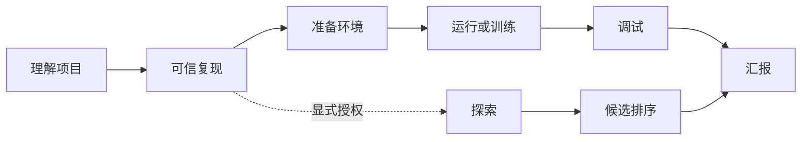
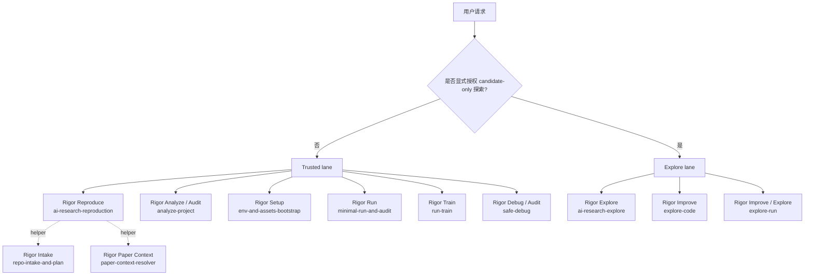
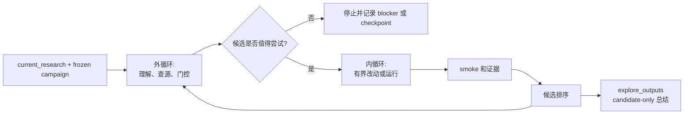

# RigorPilot Skills

面向深度学习实验的科研优先 Agent Skills。

**一句话主旨：** RigorPilot 让 AI agent 在复现、改进、探索深度学习研究仓库时，始终保留可比性、可复现实验证据和可审计的改动边界。

> 不只是更高分数，而是有意义的深度学习科研推进。

<p>
  <a href="./README.md">English</a> |
  <a href="./README.zh-CN.md">简体中文</a>
</p>

<p>
  
  
  
  
  
  
  
  
  
</p>

## ⚡ 一眼看懂

| 信号 | 你需要记住的重点 |
|---|---|
| 🧭 主旨 | 面向深度学习实验的科研优先 Agent Skills。 |
| 🔒 默认路径 | 模糊请求进入 trusted lane：复现、环境准备、运行、训练、分析或调试，避免静默改变科研含义。 |
| 🧪 显式路径 | 只有研究者明确授权 candidate-only 探索时，才在 `current_research` 上启用 explore lane。 |
| 📦 证据 | 输出落到 `repro_outputs/`、`analysis_outputs/`、`train_outputs/`、`debug_outputs/`、`explore_outputs/` 等可追溯目录。 |
| 🔗 客户端 | `SKILL.md` 是 canonical contract；支持 Codex、Claude Code 和中立 Agent Skills 安装。 |

## 🚀 快速开始

大多数用户只需要先选一个入口：

| 目标 | 安装命令 |
|---|---|
| 安装整套 RigorPilot skills | `npx skills add lllllllama/rigorpilot-skills --all` |
| trusted README-first 复现 | `npx skills add lllllllama/rigorpilot-skills --skill ai-research-reproduction` |
| 显式授权的 candidate-only 探索 | `npx skills add lllllllama/rigorpilot-skills --skill ai-research-explore` |

如果不确定该用哪个 skill，继续看下面的入口选择表。

<details>
<summary>品牌与迁移兼容说明</summary>

品牌说明：项目品牌已经收敛为 `RigorPilot Skills`；推荐 GitHub 仓库 slug 为 `rigorpilot-skills`。旧安装路径只作为兼容 fallback 保留，方便旧客户端和旧链接迁移。

迁移说明：
- 项目品牌：`ai-research-workflow-skills` -> `RigorPilot Skills`
- 现有兼容 skill slug 会继续保留。
- 推荐安装源：`lllllllama/rigorpilot-skills`
- legacy fallback 源：`lllllllama/ai-paper-reproduction-skills`
- `ai-paper-reproduction` -> `ai-research-reproduction`
- `research-explore` -> `ai-research-explore`

</details>

## 🎯 RigorPilot 是什么

- 面向深度学习实验的科研优先 Agent Skills。
- 帮助 AI agent 复现、改进、探索和审计深度学习研究工作。
- 优先服务个人科研使用场景。
- 重视科学含义、公平比较、可复现性、可解释性和协作者可控性。
- 鼓励探索阶段的 meaningful novelty，但不夸大 novelty。

## 🚫 RigorPilot 不是什么

- 不是普通 coding agent。
- 不是刷分自动化框架。
- 不是自动保证产生创新发现的系统。
- 不是研究者判断的替代品。
- 不是会削弱强模型能力的僵硬流程。

## 🔬 五条科研严谨性原则

1. 不盲目追分：分数提升必须有解释价值。
2. 不轻易声称创新：novelty 必须有文献、代码或实验依据。
3. 不破坏可比性：如果改变了评估条件，必须说明结果不可直接比较。
4. 不隐藏工程修补：工程修补不能包装成方法贡献。
5. 不让合作者失控：每次重要修改必须可审计、可回滚、可解释。

详见 [references/research-rigor-principles.md](references/research-rigor-principles.md)。

## 🧪 Rigor 与 Novel

Rigor 是底线。Novel 是探索目标。

创新性和意义在被文献对照、消融实验和公平比较支持之前，只能作为假设，不能作为结论。

RigorPilot 不应降低强模型本身的能力。它应该提供科研方向、判断标准和审计意识，而不是用过细流程限制模型推理、实现和探索能力。最差情况下，使用 RigorPilot 的体验也应接近未使用 skill；它不应让任务更难、更慢、更机械，或让强模型因为规则负担而表现变差。

## 🧠 深度学习定位

RigorPilot 主要面向深度学习研究仓库：README 命令、环境配置、数据、权重、checkpoint、训练、评估、指标、日志、baseline、SOTA 表和消融实验都会影响科研含义。

本仓库仍保留一个兼容性默认原则：`trusted by default`。

- 模糊请求默认进入 trusted lane。
- 探索必须显式授权。
- trusted 输出强调可审计、可复用、可回看。
- explore 输出始终是 candidate-only、可丢弃的探索结果。

共享操作原则见 [references/agent-operating-principles.md](references/agent-operating-principles.md)。它只规定大方向：先想清楚、保持简单、只改必要范围、以可验证目标驱动。它不是逐步脚本，具体实现细节应交给模型结合当前仓库判断。

## 🧭 当前仓库快照

当前仓库状态：

- 共 `11` 个 skill，其中 `9` 个 public skill，`2` 个 helper skill。
- 共 `6` 个 trusted-lane public skill，`3` 个 explore-lane public skill。
- `.claude/commands/` 下当前提供 `4` 个项目级 Claude Code wrappers。
- 共有 `45` 个 Python 脚本，其中 `43` 个是测试脚本，覆盖 `research-explore` 主链路和文档结构回归。
- Rigor Explore 现在已经接通：bounded idea seed generation、显式 idea score breakdown、atomic idea decomposition、以及 planned / heuristic / observed 分层的 implementation fidelity。
- 当前文档和命令示例按 Windows PowerShell 与 Linux shell 的共同使用方式整理。

本仓库采用开放的 `SKILL.md` 布局，因此同一套技能既可以安装到中立的 Agent Skills 目录，也可以安装到 Codex 和 Claude Code。共享本地安装优先使用 `~/.agents/skills/` 或 `./.agents/skills/`；`~/.codex/skills/` 和 `~/.claude/skills/` 仍然可用。

## 💻 Windows 与 Linux 使用说明

本仓库当前要求在 Windows 和 Linux 环境中都能正常使用，因此 README 中的命令示例保持为跨 shell 友好的形式。

- 下方命令统一围绕 `python ...`、`npx ...` 和相对路径编写，适合 Linux shell，也适合 Windows PowerShell。
- 用户级安装目录优先写成 `$HOME/.agents/skills`、`$HOME/.codex/skills`、`$HOME/.claude/skills`。Linux 可直接使用，PowerShell 也能正常展开；Python 在 Windows 上同样可以处理正斜杠路径。
- 项目级路径如 `./.agents/skills`、`./tmp/codex-skills` 在 Windows 和 Linux 上都可直接使用。
- 当前本地回归和 CI 说明也明确覆盖 Windows 与 Linux 场景。

## 🛠️ 安装

对大多数用户来说，优先用 `npx` 即可。这是最短路径，也最接近“开箱即用”。

### 推荐：`npx`

安装整套 skills：

```bash
npx skills add lllllllama/rigorpilot-skills --all
```

只安装 trusted 主入口：

```bash
npx skills add lllllllama/rigorpilot-skills --skill ai-research-reproduction
```

只安装 explore 主入口：

```bash
npx skills add lllllllama/rigorpilot-skills --skill ai-research-explore
```

如果你只是想尽快开始，用上面这几条就够了。

Claude Code 可以根据描述自动调用这些 skills，也可以直接使用 `/ai-research-reproduction`、`/ai-research-explore`、`/safe-debug` 这样的命令。

当前仓库提供的项目级 Claude Code slash commands：

- `/ai-research-reproduction`
- `/ai-research-explore`
- `/analyze-project`
- `/safe-debug`

### 高级用法：本地 clone 安装

只有在以下场景才建议继续用 Python 安装脚本：

- 你正在本地开发这个仓库
- 你需要 project-scoped 安装
- 你要手动安装到中立 Agent Skills、Codex 或 Claude Code 目录

<details>
<summary>展开本地安装命令</summary>

从本地 clone 安装到中立的 Agent Skills 目录：

```bash
python scripts/install_skills.py --client agents --target "$HOME/.agents/skills" --force
```

安装到项目内的中立 Agent Skills 目录：

```bash
python scripts/install_skills.py --client agents --target ./.agents/skills --force
```

使用默认中立安装目标：

```bash
python scripts/install_skills.py --force
```

在 Codex 中安装整套 skill：

```bash
npx skills add lllllllama/rigorpilot-skills --all
```

在 Codex 中只安装 trusted reproduction orchestrator：

```bash
npx skills add lllllllama/rigorpilot-skills --skill ai-research-reproduction
```

如果你的环境暂时还无法访问新 slug，可以使用 legacy GitHub source fallback：

```bash
npx skills add lllllllama/ai-paper-reproduction-skills --all
```

从本地 clone 安装到 Codex：

```bash
python scripts/install_skills.py --client codex --target "$HOME/.codex/skills" --force
```

从本地 clone 安装到 Claude Code：

```bash
python scripts/install_skills.py --client claude --target "$HOME/.claude/skills" --force
```

安装到项目内的 Claude Code skills 目录：

```bash
python scripts/install_skills.py --client claude --target ./.claude/skills --force
```

PowerShell 补充说明：

- Windows PowerShell 下，上面的命令可以直接照抄运行。
- 如果你更习惯显式 Windows 路径，也可以把 `$HOME/.codex/skills` 换成 `$env:USERPROFILE\\.codex\\skills` 这类写法。

</details>

## 🎯 入口选择

RigorPilot display name 会映射到当前兼容的 skill slug。short mode 是 RigorPilot
对外展示/文档名，也可以作为未来 alias；当前 `npx skills add --skill ...`
和直接调用仍应使用兼容 skill slug。

| 如果你想要… | RigorPilot display name | Short mode | 当前兼容 skill slug |
|---|---|---|---|
| 从 README 命令出发复现一个深度学习仓库 | Rigor Reproduce | `rigor-reproduce` | `ai-research-reproduction` |
| 在 current research 之上探索有意义、可能 novel 的 idea | Rigor Explore | `rigor-explore` | `ai-research-explore` |
| 在保持可比性的前提下改进 baseline | Rigor Improve | `rigor-improve` | `ai-research-explore`、`explore-code`、`explore-run` |
| 审计改动、科学含义和可比性 | Rigor Audit | `rigor-audit` | `analyze-project`、`safe-debug`、generated reports |
| 只分析仓库结构，不编辑 | Rigor Analyze | `rigor-analyze` | `analyze-project` |
| 准备环境、数据集、权重和缓存假设 | Rigor Setup | `rigor-setup` | `env-and-assets-bootstrap` |
| 保守执行已记录的 evaluation 或 inference | Rigor Run | `rigor-run` | `minimal-run-and-audit` |
| 保守启动或验证训练 | Rigor Train | `rigor-train` | `run-train` |
| 安全调试失败 | Rigor Debug | `rigor-debug` | `safe-debug` |

内置 helper skills：

- Rigor Intake / `rigor-intake` -> `repo-intake-and-plan`
- Rigor Paper Context / `rigor-paper-context` -> `paper-context-resolver`

## 🛣️ Lane 结构

### 🔒 Trusted Lane

trusted lane 负责复现、环境准备、只读分析、保守执行、训练验证和安全调试。

- 主 orchestrator：`ai-research-reproduction`
- 主要输出目录：`repro_outputs/`、`train_outputs/`、`analysis_outputs/`、`debug_outputs/`
- 默认立场：尽量保持科学含义不变，尽量减少语义性改动，显式暴露假设和 blocker

### 🧪 Explore Lane

explore lane 只在研究者显式授权 candidate-only 探索时启用。

- 主 orchestrator：`ai-research-explore`
- 窄职责 leaf skills：`explore-code`、`explore-run`
- 主输出目录：`explore_outputs/`
- 核心锚点：`current_research`

`current_research` 应该是一个可持续引用的研究状态，例如 branch、commit、checkpoint、run record，或者已经训练好的本地模型状态。它不是 trusted baseline 的同义词，而是探索流程起步时所依赖的上下文锚点。

### 🧰 Helper Lane

helper skills 保持窄职责，通常应该由 orchestrator 调用，而不是作为用户的第一入口。

## 🔗 客户端兼容性

本仓库中，`SKILL.md` 是跨客户端的 canonical contract。

- 便携性必需：`SKILL.md`、skill 自带的 `scripts/`、`references/`
- Codex 可选元数据：`agents/openai.yaml`
- Claude Code 可选入口：`.claude/commands/*.md`
- 不允许：让 skill 行为依赖某个 client-specific metadata 文件

详见 [references/client-compatibility-policy.md](references/client-compatibility-policy.md)。

## 🔁 生命周期视角

本仓库按研究工作流生命周期做路由：



这个生命周期只负责帮助 agent 选择正确 lane 和证据目标，不强制每个仓库都按固定步骤执行。具体实现仍交给模型根据当前仓库判断。

## 🗺️ 路由总览



## 🧠 Rigor Explore 流程

`ai-research-explore` 是 Rigor Explore 的兼容 slug：研究者已经冻结 task family、dataset、evaluation method，并且给出了 SOTA 参考；随后显式授权 AI 在 `current_research` 上进行受约束、可审计、candidate-only 的探索。这个流程之前在文档中称为 third-scenario campaign flow；按 RigorPilot 叙事，它是 meaningful and potentially novel 的候选研究工作，不是已经验证的 novelty。



当前 RigorPilot 实现的关键点：

- researcher ideas 会先保留，再按策略补充 bounded synthesized / hybrid seed ideas，输出到 `analysis_outputs/IDEA_SEEDS.json`。
- idea ranking 使用 hard gates + 显式 weighted breakdown，输出到 `analysis_outputs/IDEA_SCORES.json`。
- selected idea 会被拆成 atomic academic concepts，输出到 `analysis_outputs/ATOMIC_IDEA_MAP.md` 和 `analysis_outputs/ATOMIC_IDEA_MAP.json`。
- implementation fidelity 会区分 planned / heuristic / observed 三层证据，输出到 `analysis_outputs/IMPLEMENTATION_FIDELITY.md` 和 `analysis_outputs/IMPLEMENTATION_FIDELITY.json`。
- observed evidence 现在来自 executor 真实产出的 `changed_files`、`new_files`、`deleted_files`、`touched_paths`，而不是计划位点的伪观测。

双循环只是工作节奏，不是 never-stop 自治代理。遇到明确 blocker、科学含义不清、预算耗尽、缺少 anchor/evaluation 或需要人工 checkpoint 时应停止。Rigor Explore 不得宣称 trusted reproduction success、完整 benchmark 结论、或已经验证的 novelty。

## 📦 Public Skill Matrix

| Lane | RigorPilot display name | Short mode | 兼容 skill slug | 作用 |
|---|---|---|---|---|
| Trusted | Rigor Reproduce | `rigor-reproduce` | `ai-research-reproduction` | 端到端 README-first 复现 orchestrator |
| Trusted | Rigor Setup | `rigor-setup` | `env-and-assets-bootstrap` | 保守的环境、数据集、checkpoint、缓存规划 |
| Trusted | Rigor Run | `rigor-run` | `minimal-run-and-audit` | 保守的 inference、evaluation、smoke、sanity 执行 |
| Trusted | Rigor Analyze / Rigor Audit | `rigor-analyze`、`rigor-audit` | `analyze-project` | 只读项目分析、模型映射、风险暴露 |
| Trusted | Rigor Train | `rigor-train` | `run-train` | 训练启动验证、resume 处理、有限监控与训练记录 |
| Trusted | Rigor Debug / Rigor Audit | `rigor-debug`、`rigor-audit` | `safe-debug` | 研究仓库安全调试：先分析，批准后才 patch |
| Explore | Rigor Explore | `rigor-explore` | `ai-research-explore` | 在 `current_research` 上运行探索编排，负责 idea gate 与 experiment governance |
| Explore | Rigor Improve | `rigor-improve` | `explore-code` | 隔离分支上的候选实现、拼接、移植 |
| Explore | Rigor Improve / Rigor Explore | `rigor-improve`、`rigor-explore` | `explore-run` | 小样本 probe、短周期试验、candidate run 排序 |
| Helper | Rigor Intake | `rigor-intake` | `repo-intake-and-plan` | README 命令提取与仓库初扫 helper |
| Helper | Rigor Paper Context | `rigor-paper-context` | `paper-context-resolver` | README 与论文上下文差距补齐 helper |

## 🧪 测试覆盖范围

本 README 不伪造一个单独的 line coverage 百分比，而是直接说明当前仓库已经被哪些回归面覆盖。

| 覆盖面 | 当前范围 | 代表性测试 |
|---|---|---|
| Registry、安装、wrapper | registry 一致性、安装目标、Claude wrappers、README 路由 | `test_skill_registry.py`、`test_install_targets.py`、`test_claude_command_wrappers.py`、`test_readme_selection.py` |
| Skill 原则与简洁性 | 共享操作原则、生命周期文档、主入口简洁性 | `test_operating_principles_structure.py` |
| Trusted lane 渲染与路由 | reproduction、training、analysis、debug、lane routing | `test_output_rendering.py`、`test_train_output_rendering.py`、`test_analysis_output_rendering.py`、`test_safe_debug_output_rendering.py`、`test_training_lane_routing.py` |
| Explore 主链路编排 | dry run、campaign flow、checkpoint、abandon 路径、artifact consistency、execution feasibility | `test_research_explore_dry_run.py`、`test_research_explore_campaign_flow.py`、`test_research_explore_campaign_checkpoint.py`、`test_research_explore_campaign_abandon.py`、`test_research_explore_artifact_consistency.py` |
| Explore idea 与实现合同 | idea seeds、atomic decomposition、implementation fidelity、contract schema | `test_idea_seed_generation.py`、`test_atomic_idea_decomposition.py`、`test_implementation_fidelity.py`、`test_research_explore_contracts.py` |
| Explore 执行证据链 | training / non-training executor evidence 透传 | `test_research_explore_variant_execution.py`、`test_research_explore_nontraining_execution.py` |
| Research lookup | provider、cache、inventory rendering、repo extractors、evidence layering | `test_research_lookup_arxiv_provider.py`、`test_research_lookup_repo_extractor.py`、`test_research_lookup_inventory_rendering.py`、`test_research_lookup_evidence_layers.py` |

覆盖说明：

- `scripts/validate_repo.py` 仍然是快速的文件级 validator。
- 更深的行为合同主要由上述 explore 和 rendering 回归测试来锁定。
- GitHub Actions 会在 `ubuntu-latest`、`macos-latest`、`windows-latest` 上验证该仓库。

## 📁 输出目录

| 目录 | 作用 |
|---|---|
| `repro_outputs/` | trusted reproduction 输出包 |
| `train_outputs/` | trusted training 输出包 |
| `analysis_outputs/` | 只读项目分析，以及 research map、change map、eval contract、source inventory / support、improvement bank、idea cards、idea seeds、atomic idea map、implementation fidelity、mapping、resource plan |
| `debug_outputs/` | 安全调试诊断与 patch plan |
| `sources/` | free-first research lookup 记录，包含 `sources/records/`、稳定命名、受限 provider 解析、repo-local extraction、可审计索引 |
| `explore_outputs/` | Rigor Explore changeset、idea gate、experiment plan、experiment manifest、scientific changelog、comparability report、split static/runtime smoke reporting、ledger、top runs summary |

## 🧾 建议的科研证据体系

其中两个证据产物已经由标准 trusted / explore writer 生成，其余名称是 future-compatible evidence concepts：

| Artifact | 含义 |
|---|---|
| `SCIENTIFIC_CHANGELOG.md` | 已落地生成。记录改了什么、为什么改、是否影响科学含义、是否仍可比较。 |
| `COMPARABILITY_REPORT.md` | 已落地生成。说明结果是否仍能与 README、论文、baseline 或 SOTA 参考比较。 |
| `REPRODUCIBILITY_NOTES.md` | 记录命令、配置、seed、checkpoint、数据集、环境假设和已知缺口。 |
| `NOVELTY_CLAIM.md` | 将可能的创新写成假设，列出支持证据、缺失证据、限制和所需消融。 |
| `ABLATION_PLAN.md` | 说明需要隔离哪些变量才能验证候选改动的效果。 |
| `EXPERIMENT_LEDGER.md` | 记录 run、指标、命令、artifact、变更文件和证据状态。 |

现有的 `analysis_outputs/`、`sources/`、`explore_outputs/`、`repro_outputs/`、`train_outputs/`、`debug_outputs/` 继续兼容。RigorPilot 后续可以逐步把现有 artifact 映射到这些科研证据概念上。

## 🧩 Campaign 输入

`ai-research-explore` 仍然接受普通的 `variant_spec.json`，但 Rigor Explore campaign 更推荐使用 `research_campaign.json` 或 `research_campaign.yaml`。

campaign 的稳定核心是：

- `current_research`
- `task_family`
- `dataset`
- `benchmark`
- `evaluation_source`
- `sota_reference`
- `compute_budget`

`candidate_ideas` 和 `variant_spec` 很有用，但不是每次 campaign 都必须填写。`ai-research-explore` 会保留 researcher ideas，并且在策略允许时补充少量 bounded synthesized / hybrid seed ideas。新增 seed 会绑定 `current_research`、`task_family`、`dataset` 和冻结的 `evaluation_source`。

可选 campaign block：

- `research_lookup`
- `idea_policy`
- `idea_generation`
- `source_constraints`
- `feasibility_policy`

详见 [skills/ai-research-explore/references/research-campaign-spec.md](skills/ai-research-explore/references/research-campaign-spec.md)。

## 💬 示例提示词

**Trusted reproduction**

```text
Use ai-research-reproduction on this deep learning research repo. Stay README-first, prefer documented inference or evaluation, avoid unnecessary repo changes, and write outputs to repro_outputs/.
```

**Current-research exploration**

```text
Use ai-research-explore on top of current_research improved-model@branch. Work on an isolated branch, coordinate code and run exploration together, try several variants, and rank candidates in explore_outputs/.
```

**Third-scenario campaign exploration**

```text
Use ai-research-explore with research_campaign.json. Treat the provided task family, dataset, evaluation source, and SOTA table as frozen inputs, rank the candidate ideas, keep each candidate single-variable, and write RigorPilot evidence outputs to analysis_outputs/ and explore_outputs/.
```

**Read-only analysis**

```text
Use analyze-project on this repo. Read the code, map the model and training entrypoints, and flag suspicious patterns without editing files.
```

**Trusted training**

```text
Use run-train on this repo. Run the selected documented training command conservatively for startup verification and write train_outputs/.
```

**Safe debug**

```text
Use safe-debug on this traceback. Diagnose the failure first, propose the smallest safe fix, and do not patch until I approve.
```

**Exploratory code only**

```text
Use explore-code on an isolated branch. Try a LoRA adaptation for this backbone, keep it exploratory only, and summarize the changes in explore_outputs/.
```

**Exploratory runs only**

```text
Use explore-run on an experiment branch. Do a small-subset short-cycle sweep, rank the top runs, and treat the results as candidates only.
```

## ✅ 本地自检

运行仓库基础检查：

```bash
python scripts/validate_repo.py
python scripts/test_skill_registry.py
python scripts/test_trigger_boundaries.py
python scripts/test_operating_principles_structure.py
python scripts/test_claude_command_wrappers.py
python scripts/test_readme_selection.py
```

运行输出与 orchestrator 回归：

```bash
python scripts/test_output_rendering.py
python scripts/test_train_output_rendering.py
python scripts/test_analysis_output_rendering.py
python scripts/test_safe_debug_output_rendering.py
python scripts/test_explore_output_rendering.py
python scripts/test_explore_variant_matrix.py
python scripts/test_atomic_idea_decomposition.py
python scripts/test_idea_seed_generation.py
python scripts/test_implementation_fidelity.py
python scripts/test_research_explore_contracts.py
python scripts/test_research_explore_dry_run.py
python scripts/test_research_explore_campaign_flow.py
python scripts/test_research_explore_campaign_abandon.py
python scripts/test_research_explore_campaign_checkpoint.py
python scripts/test_research_explore_artifact_consistency.py
python scripts/test_research_explore_variant_execution.py
python scripts/test_research_explore_nontraining_execution.py
python scripts/test_orchestrator_dry_run.py
python scripts/test_training_lane_routing.py
```

运行 research lookup 回归：

```bash
python scripts/test_research_lookup_arxiv_provider.py
python scripts/test_research_lookup_doi_provider.py
python scripts/test_research_lookup_github_provider.py
python scripts/test_research_lookup_url_provider.py
python scripts/test_research_lookup_repo_extractor.py
python scripts/test_research_lookup_cache.py
python scripts/test_research_lookup_inventory_rendering.py
python scripts/test_research_lookup_evidence_layers.py
```

运行 setup 与安装相关回归：

```bash
python scripts/test_bootstrap_env.py
python scripts/test_install_targets.py
python scripts/test_setup_planning.py
python scripts/install_skills.py --client agents --target ./tmp/agents-skills --force
python scripts/install_skills.py --client codex --target ./tmp/codex-skills --force
python scripts/install_skills.py --client claude --target ./tmp/claude-skills --force
```

## 📚 参考文档

- Research rigor principles: [references/research-rigor-principles.md](references/research-rigor-principles.md)
- Deep learning experiment principles: [references/deep-learning-experiment-principles.md](references/deep-learning-experiment-principles.md)
- Shared operating principles: [references/agent-operating-principles.md](references/agent-operating-principles.md)
- Skill registry: [references/skill-registry.json](references/skill-registry.json)
- Explore variant spec: [references/explore-variant-spec.md](references/explore-variant-spec.md)
- Explore module roadmap: [references/explore-module-roadmap.md](references/explore-module-roadmap.md)
- Client compatibility policy: [references/client-compatibility-policy.md](references/client-compatibility-policy.md)
- Routing policy: [references/routing-policy.md](references/routing-policy.md)
- Trigger boundary policy: [references/trigger-boundary-policy.md](references/trigger-boundary-policy.md)
- Branch and commit policy: [references/branch-and-commit-policy.md](references/branch-and-commit-policy.md)
- Output contract: [references/output-contract.md](references/output-contract.md)
- Research pitfall checklist: [references/research-pitfall-checklist.md](references/research-pitfall-checklist.md)

## ⚠️ 当前限制

- `run-train` 是受限的训练监控器，不是长时间运行的训练调度器。
- trusted reproduction 仍然避免静默语义改动。
- helper skills 保持窄职责，不会被扩成公共兜底入口。
- exploratory work 必须与 trusted baseline 隔离。
- `ai-research-explore` 是受治理的 Rigor Explore 兼容 slug，不是开放式 autonomous research agent。

## 🧱 仓库定位

RigorPilot Skills 是面向深度学习实验的科研优先 skill 仓库，核心关注科学含义、可比性、可复现性、协作者可控性和可审计的工作边界。
